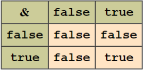
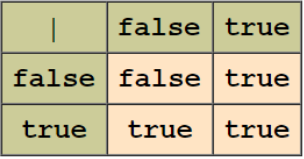

# Boolean

A boolean is a Java type that stores either `true` or `false`. 

An real world example of a boolean element is a checkbox like in the image below


The `Husk mig?` checkbox can either be checked (`true`) or unchecked (`false`)


Let's move into Java 👇

Lets say we want to create a `boolean` variable that stores the value of the checkbox above. We would do that like this:

````java
// here we declare the variable rememberMe as a boolean 
//and assign the value of false (because the checkbox is unchecked)
boolean rememberMe = false;
````


We could also store a boolean indicating if the sun is shining today:

```java
// here we declare the variable isSunShining as a boolean
// depending on the weather we either set it to true or false
// lets say the sun is shining
boolean isSunShining = true;
```


## Boolean expressions

What if we had a variable called `televisionPrice` that we wanted to check was expensive. We could fx say that prices larger than 10.000 is an expensive price. In Java we would do that like this:

```java
int televisionPrice = 12000;
boolean isTelevisionExpensive = televisionPrice > 10000;
// > reads as "is larger than"
System.out.println(isTelevisionExpensive); // true
```


There are 6 different boolean expressions:

- `x == y` - `x` is equal to `y`
- `x != y`  - `x` is not equal to `y`
- `x > y` - `x` is greater than `y`
- `x < y` - `x` is less than `y`
- `x >= y ` - `x` is greater than or equal to `y`
- `x <= y` - `x` is less than or equal to `y`


**This is perfect for something like peer instruction!!!**


Exercise possibility

a person is higher than 2 meters. So this means 


## Boolean operators/logical operator

There are different boolean operators we can use

- `&&` - And operator
- `||` - Or operator


### And operator

And operator evaluates to `true` if both the expression to the right 👉 **and** 👈 the left of the `&&` is `true`. If **one of them** is `false` the expression will be `false`

Here is a table showing and values




```java
boolean a = true && true;
System.out.println(a); // true
boolean b = false && true;
System.out.println(b); // false
boolean c = false && false;
System.out.println(b); // false

// more real world example
boolean isOwner = true;
boolean isLoggedIn = true;
boolean canEdit = isOwner && isLoggedIn;
System.out.println(canEdit); // true
```

For the real world example. Imagine we as developers need to check if a developer can edit some document. We might make a check as the one shown above


### Or operator

Or operator evaluates to `true` if the expression to the right 👉 **or** 👈 the expression to the left of the `||` is `true`. If **both** of them are `false` the expression will be `false`

Here is a table showing or values




```java
boolean a = true || true;
System.out.println(a); // true
boolean b = false || true;
System.out.println(b); // true
boolean c = false || false;
System.out.println(c); // false

// more real world example
boolean isOwner = false;
boolean hasAccess = true;
boolean canEdit = isOwner || hasAccess;
System.out.println(canEdit); // true
```


## Exercises

