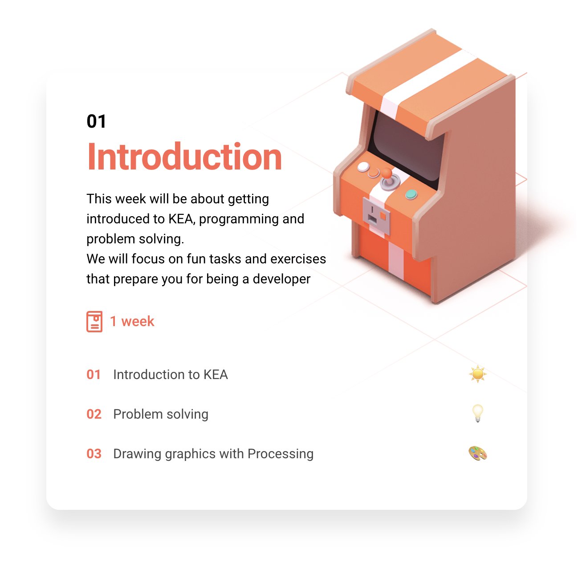

# Welcome

Welcome to this Java course. We are super excited about having you as students and have spent months now getting this course ready 🏄‍♂️

In this course you will learn Java through 16 weeks. The course is divided into 6 different modules that each will lead you on your way to becoming a proficient Java developer

## How this course will be run

In a normal week you will have lectures each day from monday to friday. In project weeks the teachers will schedule time for guidance for the different groups. 

This gitbook will be where you can find all information about this course. You can find the plan for the different weeks, the different topics that we will be going through and information about exams. 

This course will be run with two main focuses:

1. Flipped classroom teachings
2. Project based learning

### Flipped classroom teachings

All lectures has been filmed and put on YouTube. **Before** some classes it is expected that you as students have watched and taken notes for video that prepares you for the class. 

This means that we as teacher will do very little traditional teaching. The classes will instead be spent on exercises, projects, pair programming, quizzes etc. We as teachers can spend more time on guiding and helping you through tough problems. 

### Project based learning

Project based learning is learning through doing projects. These projects will solve real world problems and it will give you an opportunity to demonstrate your skills. They will involve you designing your project, working in groups, communicating, documenting what you have done and helping your teammates. 

## Course overview

Fancy images from threejs

## Studieordningen

All information relevant for you education you can find in the studieordning. Those are topics like electives, exam, learning goals for the different courses, internship, etc

[Studieordning link](https://kea.dk/images/DA/Files/Uddannelser/Studieordninger/STO-Datamatiker-2019-december.pdf)

### Bundne forudsætninger

To attend the exam you must complete three bundne forudsætninger. That is 3 parts you have to complete to attend the exam. They have to be handed in before the the exam date. 

In this course the bundne forudsætninger will be: **??????**

## Exam

The exam will take place in December todo: exact exam date

The exam will be a 20 minutes spoken exam. You will come into the classroom, pick a small problem and then solve that problem in Java. The examinators will ask questions regarding the implementation.

You can read more about the exam in the [studieordning](https://kea.dk/images/DA/Files/Uddannelser/Studieordninger/STO-Datamatiker-2019-december.pdf)

## Your teachers

### Benjamin Hughes

Digital Media Engineer from DTU. Has worked 8 years with software, primarely as a web developer. Has done interactive graphics at https://www.dr.dk/, been a co-funder at a company called Sunmapper and been an Educational Director for a web coding school called https://www.hackyourfuture.dk/

Follow him on twitter here: https://twitter.com/DalsHughes or see his always slightly outdated portfolio here: https://benna100.github.io/portfolio/

Email: behu@kea.dk

### Nicklas Frederiksen

Bundne forudsætninger

Er der noget de studernde gerne vil vide

