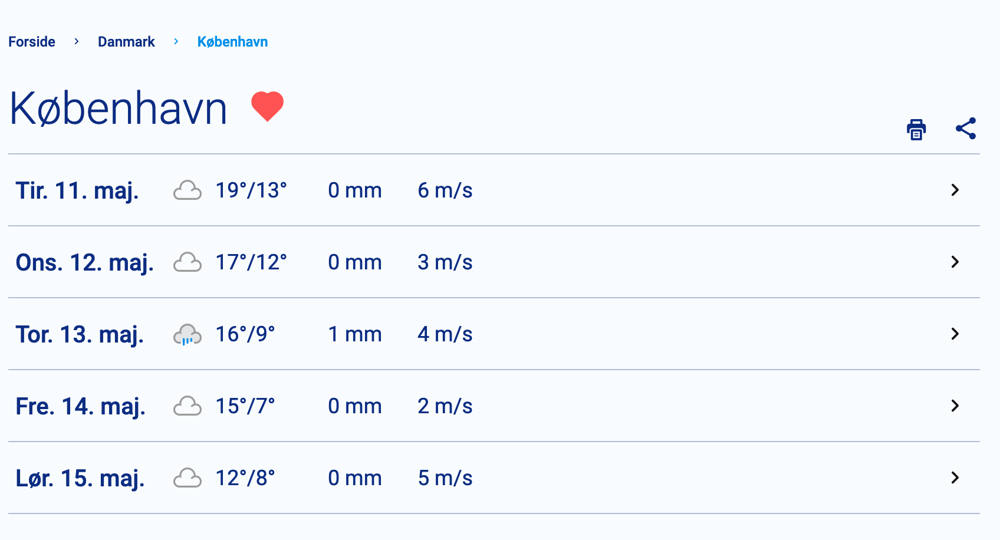

# Array

Arrays are used to store multiple elements. It can be seen as a list of things (in Java talk: an array of elements). Arrays are incredibly versatile and used everywhere. Here are a few examples


**List of days with weather information**




**List of comments on a reddit post**


**An list of clothes to pack**


Behind the scenes all these lists are powered by arrays

Enough intro for now, lets get to the meat and potatoes!


## Working with arrays in Java

Let's say we want to store an array of names. In Java that would look like this:

```java
String[] names = {"Camilla", "Per", "Cecilie", "Marie"};
```

- `String[] names` - Create an array of Strings with the name `names`
- `{"Camilla", "Per", "Cecilie", "Marie"};` - Here we define what elements should be stored in the array


The way an array works is by saving the individual elements at specific index's. The first element is saved at index 0, the second element is saved at index 1 and so on. If you think it's a bit weird that the index starts at 0, then you are not alone 👇


Let's try and create an integer array

```java
int[] numbers = {10, 20, 30, 40, 50, 60, 070, 80, 90, 100};
```

We can see that array represented below


So if you want the fifth element in the array you have to get the element at index 4! Another thing to see is the size on the array is 10, because there are 10 elements in the array


### Accessing elements in the array

Continuing with the array called  `numbers` and `names`, lets see how we can get a specific element at a index in Java:

```java
System.out.println(numbers[4]); // 50
System.out.println(names[1]); // Per
```


### Length

To get the number of elements in an array write the following:

```
System.out.println(names.length); // 4
```


### Real world example of arrays

```java
String[] loggedInUsernames = {"dankStar", "pizzaLover", "PizzaCrustLover", "banana_boat"};
// Save number of logged in users in a new variable
int loggedInUsers = loggedInUsernames.length;
System.out.println("there are " + loggedInUsers + " logged in users");
// We get the last element in the array by subtracting 1 from the number of elements in the array 
// Because we start the index at 0!
System.out.println("The last user that logged in is " + loggedInUsernames[loggedInUsers - 1]);
```


### Array methods måske!?

concat, slice, join, sort, index


## Exercises

https://kea-fronter.itslearning.com/ContentArea/ContentArea.aspx?LocationID=4434&LocationType=1&ElementID=840032

Der er masser af opgaver her: https://kea-fronter.itslearning.com/Folder/processfolder.aspx?FolderID=844270


**MÅSEK PASS BY REFERENCE PASS BY VALUE**