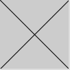
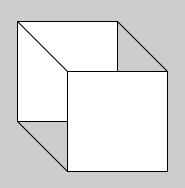
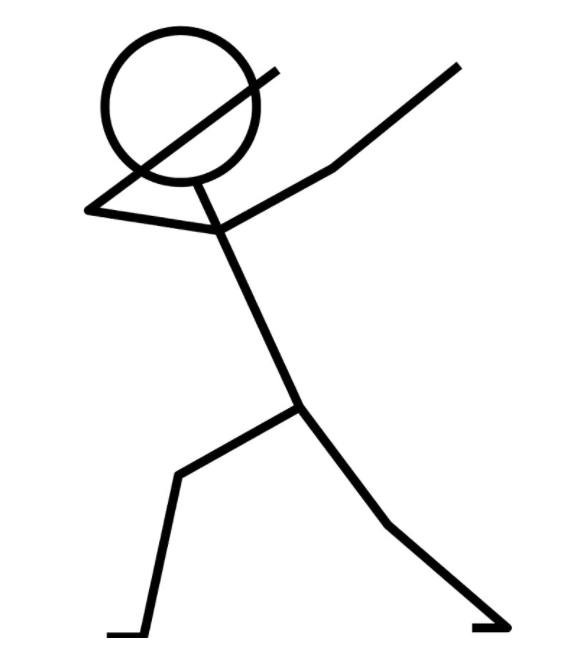
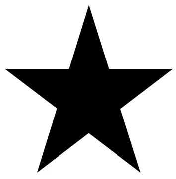
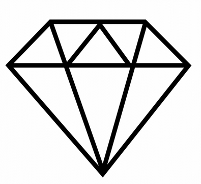

# Wednesday 8/9-2021

## Processing

Throughout the semester we will be working with the programming language **Java**. Processing is another programming language - typically seen as a **dialect of java** or **java simplified**. 

Processing is completely free and built for electronic arts, new media art and visual design. It will serve as a very basic introductory language to explore and experiment in the initial couple of days.

To download processing: https://processing.org/download/


## What are we trying to do?

We are going to write the most famout program ever made. The **"Hello World"** program.

It is a very simple program, that mostly verifies that everything is up and running.

To write a "Hello World" in processing, we are going to enter the following in the text-edit window: 

```java
println("Hello World");
```


##### To confirm that everything is working - look at the output in the **console** - it should look like this:


## Exercises

- Draw a line that is 100 pixels long

- Draw an X using lines like this: 



- Change the background to white


Answer the question: 

- Why does this program not work as intended:

```java
size(100,100);
line(0,0,500,500);
background(255);
line(0,100,100,0);
```

- Explain: what happens in the code and how can it be fixed?

  

Insert the following code in the editor:

- ```
  circle(56, 46, 55);
  ```

- What happens if you double the amount in the: first, second & third parameter?

- Draw a 3 dimensional cube like this:



- Draw a figure - you can use any shape, line and color

  Examples:

  

  

  

### First Project

We are going to build a very simple version of the classic program MS. Paint

Insert the following code

```
void setup() {
  size(640, 360);
  background(102);
}

void draw() {
  stroke(255);
  if (mousePressed == true) {
    line(mouseX, mouseY, pmouseX, pmouseY);
  }
}
```

Translate the code into english / danish

- Change the background to white

- Change the stroke to black

- Write your signature

- Screenshot your signature and hand-in here:

  https://kea-fronter.itslearning.com/ContentArea/ContentArea.aspx?LocationID=4788&LocationType=1


## FAQ - Common methods

##### Background:

https://processing.org/reference/background_.html

```
background(51);
```

##### Line: 

https://processing.org/reference/line_.html

```java
line(x-coordinate-start,y-coordinate-start, x-coordinate-start,y-coordinate-end)
```

Shapes: https://processing.org/examples/shapeprimitives.html

##### Triangle

https://processing.org/reference/triangle_.html

```
triangle(18, 18, 18, 360, 81, 360);
```

##### Rectangle

https://processing.org/reference/triangle_.html

```
rect(81, 81, 63, 63);
```

##### Quadrilateral

https://processing.org/reference/quad_.html

```
quad(189, 18, 216, 18, 216, 360, 144, 360);
```

##### Ellipse

https://processing.org/reference/ellipse_.html

```
ellipse(252, 144, 72, 72);
```

##### Arc

https://processing.org/reference/arc_.html

```
arc(479, 300, 280, 280, PI, TWO_PI);
```

##### Stroke

https://processing.org/reference/stroke_.html

```
stroke(204, 102, 0);
rect(30, 20, 55, 55);
```
