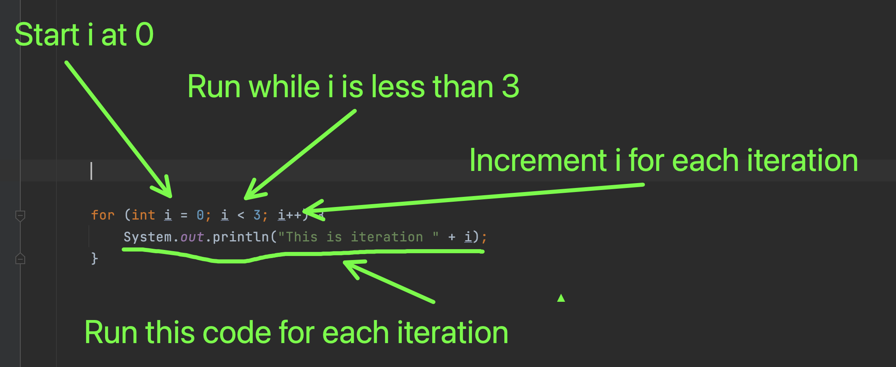

# Loops

 A Loop is a programming construct that can help with repetitive tasks. 


There are different ways of creating loops in programming languages. We will look at the most important one


## For loop

The for loop is the most used loop and one you see quite often. The syntax is a bit weird, but let's run through an example:

```java
for (int i = 0; i < 3; i++) {
    System.out.println("This is iteration " + i);
}
```

The first part is the `for`. This just tells Java that we will be creating a `for` loop. Now comes three parts of the for loop:

1. `int i = 0;` This is the starting condition. This means that Java will create a for loop where the variable `i` is `0`
2. `i < 3;` This part tells Java for how many times the for loop should run. In this example the for loop should run while `i` is smaller than `3`
3. `i++` This part tells Java what to do after each iteration. In this example the for loop tells Java to increment `i` by `1` for eacher iteration

Inside the brackets we write the code to run for each iteration. This code will print the following to the console

```
This is iteration 0
This is iteration 1
This is iteration 2
```





### Exercise

1. Use a for loop to print the numbers from 1 to 10
2. Use a for loop to print a `*` 10 times
3. Use a for loop to print the numbers starting from 5 to -5 


### Nested for loops


## While loop, do while

**SKAL VI OVERHOVEDET UNDERVISE I DEM???**

Hvis vi skal skal de selv undersøge og præsentere for hinanden. Måske endda lave en opgave til den anden gruppe!

