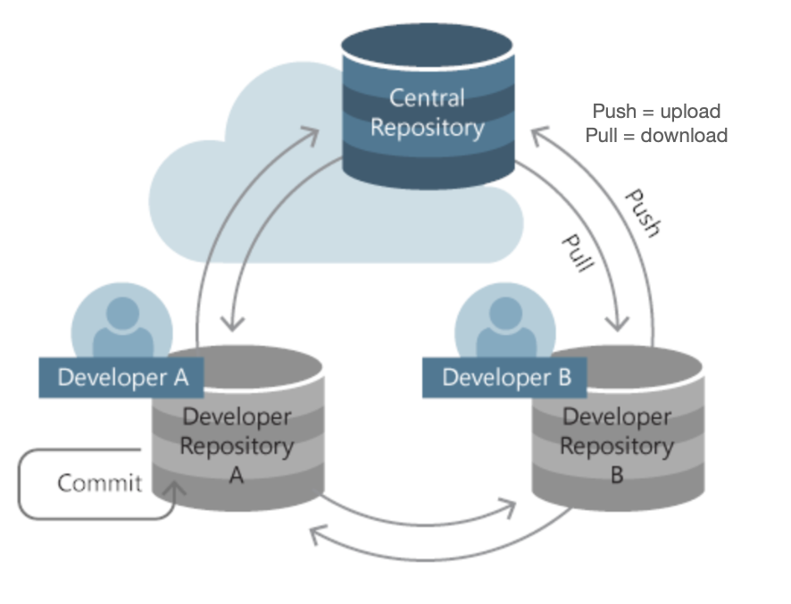

# GIT

Today we will be learning git which is a tool for collaborating on code and other projects. It makes it easy to work multiple people on the same project.

## Learning goals

- Understanding the git versioning ecosystem 
- Installing git
- Creating repositories
- Commit / Add / Pull / Push
- CodeWithMe > Git for collaboration

## Git != Github

- **Git** is a versioning / Source Control Management (SCM) tool developed by Linus Torvalds

- “*I really never wanted to do source control management at all and felt that it was just about the least interesting thing in the computing world (with the possible exception of databases ;^), and I hated all SCM’s with a passion*” - Author of the Linux kernel

- Command Line tool to version & share codebases, built on the concept of repositories
- Repository = Code project

## Github

- Online service that serves as remote repository for git repositories 
- Acquired by Microsoft $7.5B
- Explore open source code
- Host to deploy simple web-applications
  - Portfolios: https://benna100.github.io/portfolio/
  -  Git-books: https://behu.gitbook.io/java-first-semester/ External drive for text / files

## Why?

- Share code base between developers / stakeholders 
- Work distributed on a code base at the same time by:
  - Avoiding overwriting work done by others
  - Keep one source of truth Keep a version history

## A world without version control

- Sending files over email/Facebook/whatever
- What happens when two developers have changed the same code?
- What is the newest version `projectA_newest_1_new_old_new.java`

## Basic concept

## Initialising a repo

### Comparison with saving a word document

Let's first start with an analogy: Saving word documents

- You first make som changes that you would like to save
- Now you press `ctrl` + `s` and save a word document. This is saved locally on your own computer
- If you have 

git add . and git commit -m "asd" is like save in a word document

Imagine that instead of saving, you would have lots of changes and then package the individual changes

- This change is related to writing and intro
- This change is related to writing an outro

Git add is saying which changes you want to save. Git commit is packaging them in a small container called a commit. 

git push origin master is syncing with the cloud!

