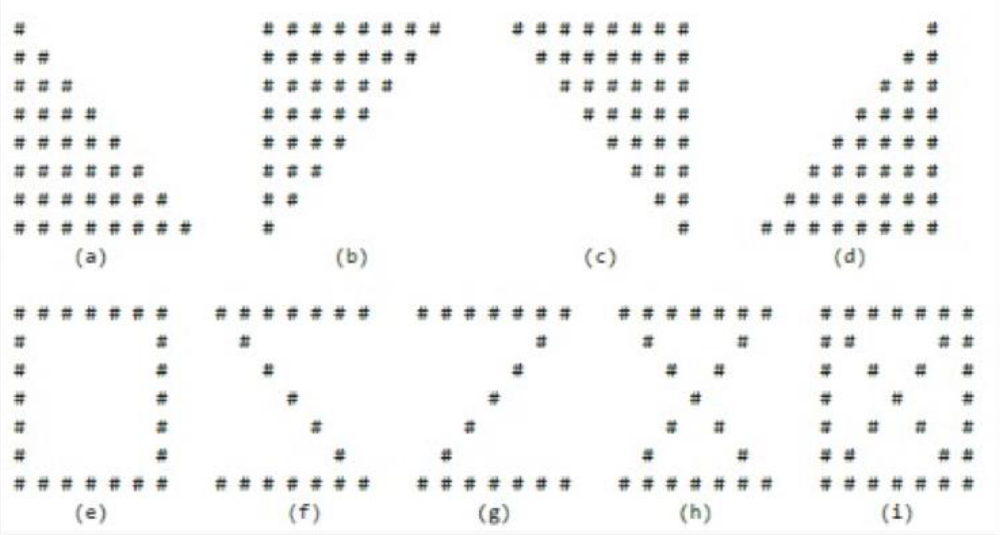

# Loops

 A Loop is a programming construct that can help with repetitive tasks. 


There are different ways of creating loops in programming languages. We will look at the most important one


## For loop

The for loop is the most used loop and one you see quite often. The syntax is a bit weird, but let's run through an example:

```java
for (int i = 0; i < 3; i++) {
    System.out.println("This is iteration " + i);
}
```

The first part is the `for`. This just tells Java that we will be creating a `for` loop. Now comes three parts of the for loop:

1. `int i = 0;` This is the starting condition. This means that Java will create a for loop where the variable `i` is `0`
2. `i < 3;` This part tells Java for how many times the for loop should run. In this example the for loop should run while `i` is smaller than `3`
3. `i++` This part tells Java what to do after each iteration. In this example the for loop tells Java to increment `i` by `1` for eacher iteration

Inside the brackets we write the code to run for each iteration. This code will print the following to the console

```
This is iteration 0
This is iteration 1
This is iteration 2
```


> There are other kind of loops like a while or do-while loop. We might get into that later. 


## Scope

Scope is a concept about where variables will be exist and where they no longer will exist. 

Let's say i wanted to do something like this 👇 

```java
for (int i = 0; i < 7; i++) {
    System.out.println("Hello");
  	System.out.println(i);
  	// Above this line number does not exist!
    int number = i;
  	// below this line number exists but only until the closing bracket!
}

System.out.println("The last number is: " + number); // Cannot resolve number
```

I make a for loop that runs from 0 - 6. Then I assign the current iteration number (`i`) to `number`

When the loop is done I print out `number`. But there is a problem! Java tells me that `Cannot resolve number`. This means cannot find `number`. The reason is that `number` only exists after it has been defined and within the curly brackets of the for loop! This is called **block scope**

To fix this problem we can define `number` before the for loop. Now `number` will be available to the for loop

```java
int number = 0;
for (int i = 0; i < 7; i++) {
    number = i;
}

System.out.println("The last number is: " + number); // prints 6
```


## Exercises

The following exercises should be done in groups of two or three people


### Exercise 1

1. Write a method that prints out ”Hello World” 3 times

2. Use a for loop to print the numbers from 1 to 10

3. Use a for loop to print a `*` 10 times

4. Use a for loop to print the numbers starting from 5 to -5 


### Exercise 1.1

Find a partner group. One groups investigates while loops while the other investigates do while loops. 

You have 30 minutes to prepare a presentation for the other group explaining the loop type you got. When preparing focus on these things

- How does the loop type work?
- Write a practical code example of how to use the loop type
- In what situations should someone use your loop type?

The presentation should be around 5-10 minutes. Have the presentation as you like. If slides works for you then use it, if just code works for you the use that, if a document is better then use that. 


### Exercise 2

Write a method that prints out the statement

 `I am now printing for the [Num-ber of iteration]th time`

Run 10 iterations.


### Exercise 3

Write a method that prints a random number of hashtags # (Maximum 10)

*Hint - try google `java random number between`* 


### Exercise 3 - Nested for loops

You can have a for loop in a for loop. See if you can print the following patterns to the console





