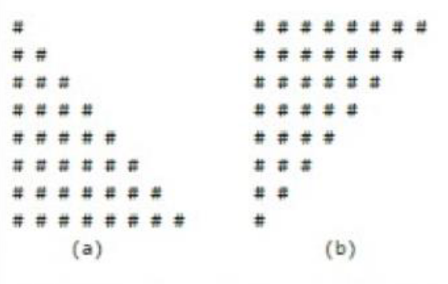
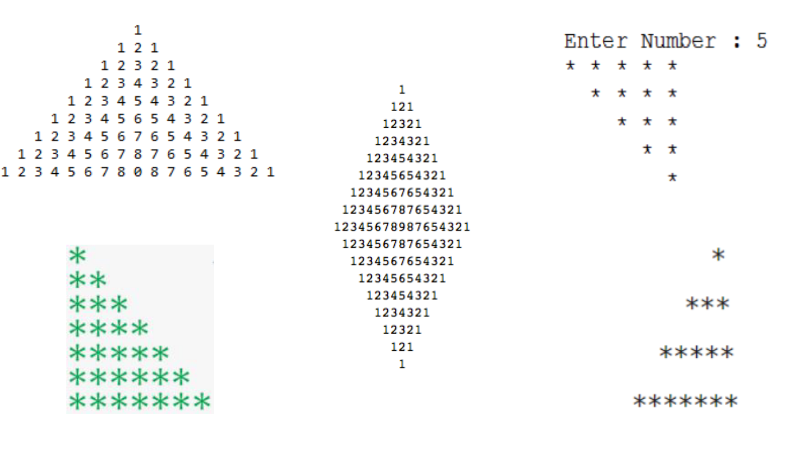

# Loops

 A Loop is a programming construct that can help with repetitive tasks. 


There are different ways of creating loops in programming languages. We will look at the most important one


## For loop

The for loop is the most used loop and one you see quite often. The syntax is a bit weird, but let's run through an example:

```java
for (int i = 0; i < 3; i++) {
    System.out.println("This is iteration " + i);
}
```

The first part is the `for`. This just tells Java that we will be creating a `for` loop. Now comes three parts of the for loop:

1. `int i = 0;` This is the starting condition. This means that Java will create a for loop where the variable `i` is `0`
2. `i < 3;` This part tells Java for how many times the for loop should run. In this example the for loop should run while `i` is smaller than `3`
3. `i++` This part tells Java what to do after each iteration. In this example the for loop tells Java to increment `i` by `1` for eacher iteration

Inside the brackets we write the code to run for each iteration. This code will print the following to the console

```
This is iteration 0
This is iteration 1
This is iteration 2
```


> There are other kind of loops like a while or do-while loop. We might get into that later. 


## Scope

Scope is a concept about where variables will be exist and where they no longer will exist. 

Let's say i wanted to do something like this 👇 

```java
for (int i = 0; i < 7; i++) {
    System.out.println("Hello");
  	System.out.println(i);
  	// Above this line number does not exist!
    int number = i;
  	// below this line number exists but only until the closing bracket!
}

System.out.println("The last number is: " + number); // Cannot resolve number
```

I make a for loop that runs from 0 - 6. Then I assign the current iteration number (`i`) to `number`

When the loop is done I print out `number`. But there is a problem! Java tells me that `Cannot resolve number`. This means cannot find `number`. The reason is that `number` only exists after it has been defined and within the curly brackets of the for loop! This is called **block scope**

To fix this problem we can define `number` before the for loop. Now `number` will be available to the for loop

```java
int number = 0;
for (int i = 0; i < 7; i++) {
    number = i;
}

System.out.println("The last number is: " + number); // prints 6
```


## Exercises

### Exercise 1.1

Find a partner group. One groups investigates `while` loops while the other investigates `do while` loops. 

You have 20 minutes to prepare a presentation for the other group explaining the loop type you got. When preparing focus on these things

- How does the loop type work?
- Write a practical code example of how to use the loop type
- In what situations should someone use your loop type?

The presentation should be around 5 minutes. Have the presentation as you like. If slides works for you then use it, if just code works for you the use that, if a document is better then use that. 


### Exercise 1.2

Read the following code

```java
class Variable{
    public static void main(String[] args){
        String a = "Umbrella";
        boolean per = false;
        for(int i = 0; i < a.length(); i++){
            if(a.charAt(i) == 'e'){
                per = true;
                break;
            }
        }
        System.out.println(per);
    }
}
```

Now explain what it does and what it will output.

*No cheating!*


### Exercise 1.1

1. Print out `Hello World` 3 times
2. Use a loop to print the numbers from 1 to 10
3. Use a loop to print a `*` 10 times
4. Use a loop to print the numbers starting from 5 to -5 
5. Use a loop to print every third number from 5 to 30

*Try using both a `for` loop and a `while` loop*


### Exercise 2

Write a method that prints out the statement

 `I am now printing for the [Number of iteration]th time`

Run 10 iterations


### Exercise 2.1

Prints a random number of hashtags (`#`) (Maximum 10)


### Exercise 3

Download FeelJava here: https://www.dropbox.com/s/5ji2fmthdm5a2eh/feeljava0.7.jar?dl=1

Using FeelJava and loop of your choosing, create a series of rectangles. The rectangles should change

- Position
- Size
- Color

This is how you draw a single rectangle 👇

```java
public void drawRectangle(Canvas cv){ 
	 // Setup GraphicsContext2D
   GraphicsContext gc = cv.getGraphicsContext2D();
   // Clear the drawing rect
   gc.clearRect(0,0,650,700);
   // set the color of the rectangle
   gc.setFill(Color.GREEN);
   // Fill the rectangle with width and height of 180
   // and position x: 100, y:200
   gc.fillRect(100,200,180,180);
} 
```


### Exercise 3.1

Print multiplication table of 24, 50 and 29 using loop.


### Exercise ⭐️

Create code that will output these two:



### Exercise ⭐️⭐️

Create the same as above, but now the user has to input the number of rows!


### Exercise 4.1

Write a program to find the number of vowels, consonents, digits and white space characters in a string. 


### Exercise 4.2

Write a program that replaces all spaces with 👏 and makes the text uppercase. 

Here is an example:

```
I am happy today
I👏AM👏HAPPY👏TODAY
```


### Exercise 4.3

Write a program that will return `true` if a word somewhere has letters that comes after each other in the alphabet. 

Fx the word Abracadabra should return `true` because the two characters `A` and `b` comes after each other in the alphabet and comes after each other in the word.

Hello should return `false` because there are no characters that comes after each other in the alphabeat

Nope should return `true` because `n` comes after `o`


### Exercise 5

Write a program that takes your full name as input and displays the abbreviations of the first and middle names except the last name which is displayed as it is. 

For example, if your name is Robert Brett Roser, then the output should be R.B. Roser. Or Benjamin Dalsgaard Hughes will be B.D. Hughes


### Exercise minus 1.1

Using FeelJava create a chess board pattern using loops


### Exercise 5.1

Write a program to find greatest common divisor (GCD) or highest common factor (HCF) of given two numbers 


### Exercise 9000

https://adventofcode.com/2020/day/3

Take your input and just copy paste it into a string to work with


### Exercise 5 - Nested for loops

You can have a for loop in a for loop. See if you can print the following patterns to the console




