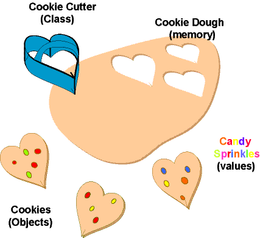

# Classes

You have now learned all the necessary building blocks of Java. `String`, `int`, `forloop`, `methods`, `conditional` these are all blocks that we need to build Java. **But** in order to write code that is 

- Better structured
- Better abstracted
- More maintainable
- More secure

we need to talk about classes! 

It's an essential part of Java that allows us to represent data in a better way.


## But why??

Let's go through a concrete example where classes can help us writte better code. 

Let's say we have an application that works with students. It could be an application that creates schedules for a school. 

Let's say a student has a name, an age and an array of his/her grades. Lets try and represent that with the code we have learned so far:

```java
String studentName = "Cathrine Hansson";
int age = 23;
int[] grades = {10, 4, 7, 7};
```

Okay, so this kind of works. I could do some operations on the individual variables, like finding the highest grade. But now a new student comes in, hmm. Okay let's rewrite the code👇

```java
String studentName1 = "Cathrine Hansson";
int age1 = 23;
int[] grades1 = {10, 4, 7, 7};

String studentName2 = "Peter Jon";
int age2 = 27;
int[] grades2 = {12, 4, 4, 7};
```

Hmm okay that's not super nice. What if there were 200 students in the system, then i would have to create 200 students * 3 attributes = 600 variables. This would simply not work and would be **massively** error prone. So then what? In comes classes. 


## Object orientation

- As applications grows - their code base grows
- As growth implies complexity, it is beneficial to organise code into 
  understandable & manageable groupings.
- Object orientation is a concept - “philosophy” - of writing programs.


### Thinking object oriented


Let's look at creating a student. What parameter could be relevant? What is the blueprint of a Student. 





**Cookie cutter (blueprint)**

```java
class Cat {
    public String name;
    public int mood;
    public boolean isHungry;
    public int energy;

    public void meow() {
        System.out.println("meow");
    }
}
```


**Cookies (objects/instance of Student)**

```java
import java.util.Random;
import java.util.Scanner;

public class CatStarter {
    public static void main(String[] args) {
        Cat figaro = new Cat();
        figaro.meow();
        figaro.name = "figaro";
    }
}
```


### Constructors


As we saw before we could change the name of `figaro` by writing 

```java
figaro.name = "figaro";
```

There is a better way to do this and that is through the constructor. Lets update the `Cat.java` class:


```java
class Cat {
    public String name;
    public int mood;
    public boolean isHungry;
    public int energy;

    public Cat(String name, int mood, boolean isHungry, int energy) {
        this.name = name;
        this.mood = mood;
        this.isHungry = isHungry;
        this.energy = energy;
    }

    public void meow() {
        System.out.println("meow");
    }
}
```

Now we can create a new cat like this

```java
public class CatStarter {
    public static void main(String[] args) {
        Cat figaro = new Cat("figaro", 5, true, 7);
        figaro.meow();
        System.out.println(figaro.name); // "figaro"
    }
}
```


## Encapsulation

Changing to private!


TL:DR Data & methods are bundled in objects - well implemented encapsulation 
prevents direct access to the data to prevent unwanted changes in data

I.E Only make acceptable changes of cats available to the users of a cat object


### But why even have encapsulation?

- A person (object) is born with a CPR-number. It cannot be changed (for the sake of the example) 
- A cat (object) can maximum have 10 happiness points 
- What is the disadvantage of public attributes?


Static hvornår skal det ind? Måske senere


## Exercises

### Exercise 1

Create a dog class

- 4 attributes
- 1 method
- Create 2 instances of dogs using the constructor!


### Exercise 2

Create a `DogFarm` class that creates and returns `Dog` objects with data inputtet from the user.

The maximum / minimum of mood, energy & hunger is 10 / 0

If a method that raises an attribute to more / less than 10 / 0 - The attribute do not change, but prints out - Cat is at max / min [mood/energy/hunger]

