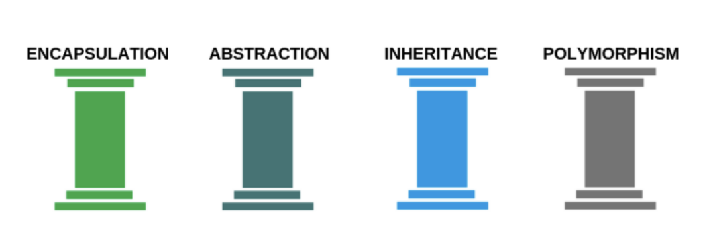

# Inheritance

## 4 pillars of OOP inheritance

## Why does inheritance make sense

Because we dont want to repeat ourselves. D.R.Y. - Dont repeat Yourself

- All users should have a username and a password and all users should be able to generate a new password. 
- Only the Admin has a email attribute and can show statistics

### Override

## Encapsulation

Changing to private!

TL:DR Data & methods are bundled in objects - well implemented encapsulation 
prevents direct access to the data to prevent unwanted changes in data

I.E Only make acceptable changes of cats available to the users of a cat object

### But why even have encapsulation?

- A person (object) is born with a CPR-number. It cannot be changed (for the sake of the example) 
- A cat (object) can maximum have 10 happiness points 
- What is the disadvantage of public attributes?

Static hvornår skal det ind? Måske senere

## Exercises

Write  an  abstract  class  called  ”Animal”.   An  animal  has  3  attributes:  name, nrOfLegs  &  isMammal.  Animals  can  also  produce  sounds  (represented  as  astring of the sound), and every animal produces a unique sound.

Create 3 animal classes that all extends the abstract Animal class and overridesthe method produces their unique sound.

Create an array, add your animals to the list and print every animals sound
