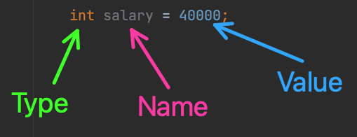
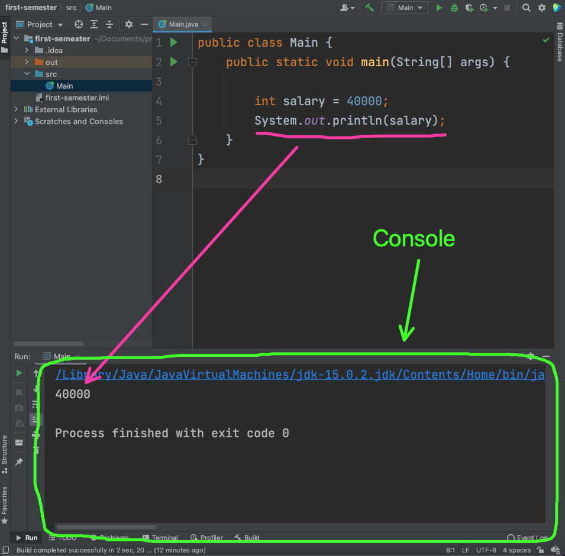

# Variables


Today we will be working with operators and variables. 


## Variables

A variable is a container for some value (data). As the image shows below we can save the number 22 (value) in a variable we call `x`. In Java that would look like this:

```java
int x = 22;
```


Lets disect the above code example:

- `int` is the **type** of the variable
- `x` is the **name** of the variable
- `22` is the value we **assign** to the variable called `x`


Let's make a more real world scenario:

```java
int salary = 400000;
```

In this example we assign the value of `400000` to a variable called `salary`. The type of `salary` is `int`




### Types

In Java it's very important that the type of the variable is specified. Not all programming languages are like that but Java is **very** strict with this!

There are lots of different types in Java. Let's have a look at some of them:

- `int` - Stores integers. Integers are whole numbers. That means `2`, `-344` or `6000` but not `2.2` or `3.1415`
- `double` - Stores numbers with decimal. Fx `2.2` or `3.1415`
- `char` - Stores a single character. Fx the character `a` or the character `y`. `char` have single quotation around them `'a'` or `'y'`
- `string` - Stores text. So if i wanted to store my name or the the city Copenhagen. String are stored with double quotation around them `"Benjamin"`, `"Copenhagen"`

You can read up on more more Java types here: https://www.w3schools.com/java/java_data_types.asp dont get too frightened we will learn the types as we progress with the language. One thing at a time 😄


#### Type space

SKAL JEG SNAKKE OM HVOR MEGET PLADS DE TAGER?


### Print out your variables

To see the value of your variables we print the value to the console. Now what does that mean? 

The console you can see as way for us developers to know how our program is doing. A console can help us write correct code. In the console fx we can see errors  that were thrown or warnings. 

To print something to the variable write the following:

```java
System.out.println(23);
```

This will print `23` to the console. We can print whatever we want to fx

```java
int salary = 400000;
System.out.println(salary);
```

Now `400000` will be printed to the console!


#### Where to find the console

When you run your Java application the console should appear in the bottom of the IDE!





### Some more code examples

When i write `//` in Java that means a comment. A comment is invicible to Java and will not be seen

```java
// variable declaration but no assignment
int pages;
// assignment happens later!
pages = 456;
// the variable called pages can be reassigned (changed)
pages = 455;

// lets try and declare and assign a string
String bookTitle = "To the sea";
// lets try and change that!
bookTitle = "From the sea";
```


### Variable Exercise

Create a new Java class called `Person.java`. Use the code below as a start

```java
public class Person {
    public static void main(String[] args) {
				// Write your code here
    }
}
```


Do these steps one step at a time! Think about what type of data should be stored in the different variables

1. Create a variable called `age` (no assignment!)
2. Create another variable called `height`
3. Assign `age` to be your age
4. assign `height` to be your height in meter
5. Create the variable `showSize` and assign it to be your showsize
6. Create a variable called `name` and assign this to your name

*Remember to compile at each step!*


**DER SKAL NOK EN OPGAVE MERE HER, MÅSKE KAGE OPGAVEN?? https://kea-fronter.itslearning.com/ContentArea/ContentArea.aspx?LocationID=4434&LocationType=1&ElementID=846013**


**HVORNÅR SKAL VI SNAKKE SCOPE??? Loops, conditionals, methods**